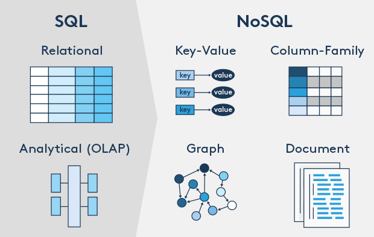

# Bases de Datos NoSQL

### ¿Que es NoSQL?

El primer error que se comete cuando escuchamos el termino **NoSQL** es llegar a la conclusión que este tipo de bases de datos son totalmente desentendidas del lenguaje de consulta **SQL** \(Strunctured Query Languege\), pero esto no es así. El termino **NoSQL** realmente significa _**Not Only SQL,**_ lo cual nos dice que son bases de datos que **no solo** son **SQL**, que existen otras maneras de estructurar la información.

La principal diferencia que existe en las bases de datos **SQL** y **NoSQL** es la relacion entre sus entidades. Las bases de datos **SQL** son consideradas relacionales, compuestas por tablas que están organizadas en columnas, cada columna almacena un tipo de dato en especifico \(int, smallint, char, varchar, date, etc.\) y cada fila representa una instancia o registro de la tabla. Las bases de datos **NoSQL** son consideradas **no relacionales,** no almacenan los datos en tablas, en lugar de eso hay múltiples formas de almacenar los datos en este tipo de bases de datos. Actualmente existen 4 formas de almacenar la información, **Key-value stores, Document databases, Column stores, Graph databases**.

### Key-Values stores

La estructura de los datos en las bases de datos **key-value** esta dado por medio de diccionarios, un valor se puede almacenar como un entero, una cadena, JSON, o una matriz, con una clave que se utiliza para hacer referencia a ese valor, por ejemplo, podría tener la identificación del cliente como clave, que se refiere a un valor que contiene una cadena del nombre del cliente.

Estas tipo de bases de datos se caracterizan por ser muy rápidas en su almacenamiento, esto es debido a su alta simplicidad, ademas tiene una función de almacenamiento en cache lo que permite a los usuarios almacenar y recuperar datos lo más rápido posible. Por todas esas características las bases de datos **Key-Values** son consideradas las más simples en el mundo de las bases de datos **NoSQL**.

### Document databases

Los datos en este tipo de bases de datos es almacenada en forma de documentos y colecciones, un documento puede ser un archivo **PDF**, **Word**, **XML** o **JSON** \(este ultimo es el más utilizado\). A diferencia de las columnas y los tipos de datos, un documento contiene pares de valores clave. Cada documento no tiene que estar en la misma estructura que otros documentos, debido a esto, para agregar datos adicionales, simplemente puede agregar más documentos sin tener que cambiar la estructura de la base de datos, el modelado de datos flexible elimina la necesidad de forzar el ajuste de modelos de datos relacionales, ya que puede manejar estructurados, datos no estructurados y semiestructurados, y rendimiento de escritura rápida sobre una consistencia estricta.

### Column store

La forma como las bases de datos orientadas a columnas almacenan datos es, como su nombre lo dice, en columnas agrupadas en lugar de filas de datos. utiliza un concepto llamado espacio de teclado, que es similar al esquema de un modelo relacional. El espacio de claves contiene múltiples familias de columnas. Las familias de columnas son similares a las tablas en un modelo relacional. Tienen una llave de fila y otra de columnas para hacer consultas muy rápidas y guardar grandes cantidades de información, aun así para modelar los datos se puede volver un poco complicado. Los usamos en **Big Data,** **IoT**, sistemas de recomendaciones, entre otras.

Referencia: [https://medium.com/@mark.rethana/introduction-to-nosql-databases-c5b43f3ca1cc](https://medium.com/@mark.rethana/introduction-to-nosql-databases-c5b43f3ca1cc)

### Graph databses

Las bases de datos basadas en Grafos nos permiten establecer conexiones entre nuestras entidades para realizar consultas de una forma más eficiente que bases de datos relacionales. Es un sistema de administración de bases de datos en linea con métodos **Create**, **Read**, **Update** and **Delete**\(CRUD\) que expone un modelo de datos en grafos. Las bases de datos basadas en grafos generalmente se crean para uso con sistemas transaccionales\(OLTP\), como también para estructuras complejas donde existen muchas relaciones entre las entidades, este tipo de bases de datos nos permitirán acceder en corto tiempo a la información. En consecuencia, normalmente están optimizados para el rendimiento transaccional y se diseñan teniendo en cuenta la integridad transaccional y la disponibilidad operativa.

Referencia: [https://pdfs.semanticscholar.org/f511/7084ca43e888fb3e17ab0f0e684cced0f8fd.pdf](https://pdfs.semanticscholar.org/f511/7084ca43e888fb3e17ab0f0e684cced0f8fd.pdf)

### Pros y Contras

