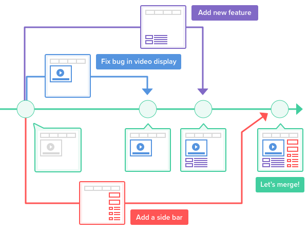
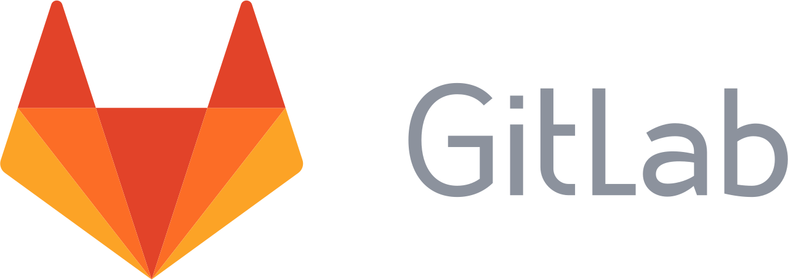
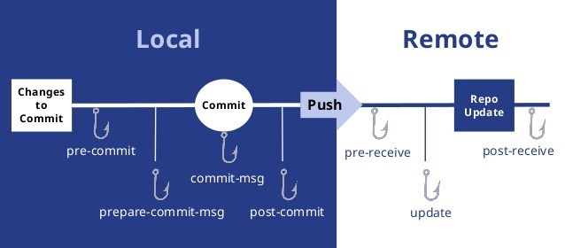

# Git el ADN del Desarrollo de Software

### Antes de la llegada de Git

Seguramente en sus computadores es muy común encontrar esto:

Realizar una copia es como comúnmente se lleva un registro de las nuevas mejoras que se han llevado a cabo en nuestros proyectos. Existían muchos problemas antes de la llegada de git, en mi opinión trabajar en equipo era el más complicado, como logras que varias personas estén trabajando sobre el mismo proyecto y al final del día lleguen a integrar sus cambios, una tarea tediosa ?¿verdad?, ademas de esto no se tenia un control de tiempo de cada versión, saber en que momento se realizo el cambio, que cambios específicamente se realizaron, quien realizo esos cambios etc. El tiempo es uno de los recursos mas importantes en el mundo, y siempre buscamos optimizar los procesos para ahorrar este recurso que puede ser aprovechado para otros procesos. El ahorro de tiempo en los equipos de trabajo depende mucho de tener una buena comunicación. Anteriormente a la llegada de git los equipos de trabajo dedicaban mucho tiempo para integrar los cambios en los que trabajaban, se tenían que reunir y explicar las novedades y corregir problemas, esto demandaba mucho tiempo.

El tiempo es uno de los recursos mas importantes en el mundo, y siempre buscamos optimizar los procesos para ahorrar este recurso que puede ser aprovechado para otros procesos. El ahorro de tiempo en los equipos de trabajo depende mucho de tener una buena comunicación. Anteriormente a la llegada de git los equipos de trabajo dedicaban mucho tiempo para integrar los cambios en los que trabajaban, se tenían que reunir y explicar las novedades y corregir problemas, esto demandaba mucho tiempo.

Estos son algunos de los problemas que se presentaban antes de la llegada de git al mundo del desarrollo de software y cambiar nuestras forma de trabajar. Con esto seguramente ya tienen una baga idea de lo que es git y como se ha pasado a ser parte del ADN de un desarrollador de software.


El termino freelance nace en la antigua edad media que significa "lanza libre", era otorgada a aquellos caballeros que no servían a ningún señor, en pocas palabras eran mercenarios que prestaban un servicio según sus habilidades a cambio de una remuneración económica. Actualmente el termino freelance es muy popular, y ya es una profesión certificar. Especialmente este termino es muy usado en el mundo del desarrollo de software, los freelance son contratados para el desarrollo de aplicativos, y lo mas importante de todo, lo hacen de manera remota, pueden estar en sus casas trabajando independientemente. Pues git impulso mucho el crecimiento de esta profesión


### ¿Qué es Git?

Git es un sistema de control de versiones desarrollado por **Linus Torvalds**, el mismo creador del **kernel Linux**, que inicialmente se diseño para entornos linux, pero actualmente es multiplataforma y podemos tenerlo en sistemas Windows y MacOS. Ahora la pregunta es, **¿Que es un sistema de control de versiones?** Es la gestión de los diversos cambios a lo largo del tiempo que se pueden presentar en los elementos de un proyecto o producto que se este desarrollando, estos cambios son adoptados como nuevas versiones que deben ser registradas y accesibles cuando sea necesario. 

Según la documentación oficial, _"... Git comenzó con un poco de destrucción y encendida polémica."_  Como bien sabemos Lunux es un proyecto de software de código abierto bastante grande, entonces empezaron a usar un **Sistema de Control de Versiones Distribuido\(DVCS\)** llamado **BitKeeper** pero que para el 2005 dejo de ser gratuita y la comunidad se vio en la necesidad de crear su propia herramienta de control de versiones, en especial **Torvalds**, pero que fuera diferente a las tecnologías que en el momento ofrecían el servicio para el control de versiones. Las principales características de git son:

* Rápida gestión
* Diseño sencillo de usar
* Desarrollo no lineal\(múltiples ramas en paralelo\)
* Gestión distribuida
* Capaz de manejar grandes proyectos de manera eficiente 


Documentación oficial,  [una breve historia de Git](https://git-scm.com/book/es/v1/Empezando-Una-breve-historia-de-Git).


### Los tres estados

Las archivos y directorios que se van modificando dentro de nuestros proyectos van pasando por unos estados de preparación que se encargan de gestionar las versiones. La simplicidad de git cuenta con tres estados, **modified, committed y  staged**. Cuando se están realizando cambios en un archivo o conjunto de ellos, en ese momento estos se encuentran en el estado **modified,** una vez se tenga los cambios necesarios listos, se pasa los archivos al estado de **staged,** en este punto los archivos están listo para ser registrado localmente de manera persistente, y ese ya seria el ultimo estado, el estado **committed,** todos los archivos pasan a ser almacenados de manera segura en las bases de datos locales de git.

Los estados están relacionados con tres estancias dentro de este flujo de git. Inicialmente esta la estancia W**orking directory**, y como su nombre lo dice, es el directorio donde reposa nuestro proyecto, los directorio y bases de datos de git, solo los cambios que se hagan dentro de este directorio serán gestionados por git. **Stagin area**, esta ligada directamente al estado **staged,** es la estancia donde pasan todos nuestros archivos que ya están listos para ser almacenados en las bases de datos de git. Por ultimo tenemos la estancia **Git repository**, estancia donde se encuentran el registro de las modificaciones realizadas, y el almacenamiento en las bases de datos de git para que estos cambio no se pierdan y sean gestionados por git.

### Branches

### Buenas practicas 

Uno de los objetivos que busco la comunidad de Linux y **Linus** **Torvalds** con su sistema de control de versiones era poder trabajar paralelamente en sus proyectos, y crearon el termino **Branch** o **Rama** en español. Un **Branch** es una bifurcación que se le hace al proyecto donde se puede trabajar en nuevos cambios sin interrumpir el trabajo de otra persona. En Git tenemos un branch principal creado por defecto llamado **Master,** esta es la linea principal del proyecto y sobre ella se desprenden los branches. Una vez se consiga la funcionalidad buscada por la cual se abrió el branche, este etaria listo para pasar al branch Master e integrar su funcionalidad, se realiza un proceso de fusión denominado **Merge**, así múltiples personas pueden trabajar en sus respectivos branches simultáneamente sin afectar los cambios o progreso de los demás.

En la imagen se puede detallar como se trabaja paralelamente en diferentes branches, donde en cada una de ellas se agregan nuevas funcionalidades y en otras se corrigen bugs, al final se integra todo los cambios en la rama principal master. Cuando creamos un branch todos los commits que se realcen dentro de este tambien seran gestionados y administrados por git, llevando un historial de todos los cambios o versiones. La mayor ventaja de trabajar con branches es el tiempo que se puede llegar ahorrar mientras todo el equipo trabaja paralelamente en nuevas funcionalidades y/o corrección de bugs.

### Git una maquina de tiempo

Es normal que en situaciones estemos trabajando en una nueva funcionalidad dentro de un branch y las cosas no salgan bien, puede ocurrir que un commit anterior tenia una versión más estable a la actual, en ese caso **Git** permite regresar a commits anteriores donde el proyecto era funcional o más estable. Existen varias formas de poder hacer estos retrocesos en el historial de un repositorio, algunas son simples de usar y muy útiles, otras requieren de mucho cuidado por el grado de accedo que podemos tener a todas el historial.

El comando _**git commit  --ament**_  es la forma más conveniente y fácil de poder regresar al commit inmediatamente anterior y añadir nuevos cambios o solo cambiar el mensaje del commit.

Es posible ir más hacia atrás en el tiempo, hasta un momento especifico, como si del **Delorian** se tratara y se especifique la fecha y lugar a donde queremos viajar. El comando _**git checkout &lt;commit&gt;**_ permite regresar a un commit anterior especifico utilizando su hash identificador, este movimiento el historia de un repositorio es temporal, podemos realizar cambio, pruebas o simplemente dar un vistazo del proyecto en ese punto, sin embargo es posible regresar nuevamente donde se estaba. Existe la posibilidad de poder viajar a ese punto y abrir un nuevo branch\(como si fuera una nueva linea de tiempo\), con el comando _**git checkout -b  name-new-branch  &lt;hash commit&gt;**_ regresamos al commit especificado y creara el branche desde ese punto.

Por ultimo tenemos una forma de regresar a un commit con la cual tenemos que tener mucho cuidado, el comando _**git  reset --hard &lt;hash-commit&gt;**_ permite ir hasta el commit deseado pero eliminara todo el historia posterior a ese commit, es por eso que este método es muy riesgoso.   

### GitHub y GitLab

Con la llegada de Git como un novedoso sistema de control de versiones distribuido open-source, nace la necesidad de poder alojar en algún servidor estos repositorio de nuestros proyectos que están gestionados bajo Git, permitiendo que todo el equipo de trabajo pueda acceder a eses repositorios y poder compartir los cambio o versiones lanzadas. Entonces nacen unos servicios de hostin de repositorios basados en el motos de Git como lo son **GitHub** y **GitLab.**

**GitHub** fue lanzado en 2008 por Tom Preston-Werner, Chris Wanstrath y PJ Hyatt. Fue el primer proveedor de hosting de Git en el mercado, ademas es una comunidad colaborativa de desarrolladores de software. Inicialmente con una cuenta gratuita se tenia un numero ilimitado de hostin públicos y si se deseaba tener un repositorio privado, era necesario pagar por ello. Ahora GitHub cuenta con numero de repositorios privados gratuitos. Actualmente es el servicio de hosting más popular y usado por los desarrolladores de software.

**GitLab,** al igual que GitHub, es un servicio de hosting de repositorios Git, con base en el motor de Git. Este fue lanzado para el 2011, que ofrece muchas funcionalidades adicionales a GitHub, como un canal de integración continua\(CI\) para sus proyectos. Por otra parte visualmente tiene un excelente diseño que es muy atractivo para los usuarios. GitLab desde sus inicios cuenta con un numero ilimitado de repositorios privados, pero a diferencia de GitHub su rendimiento no es tan bueno cuando consideramos las peticiones push y pull. 

Realmente es muy difícil decidir cual de estos servicios utilizar, cuentan con características únicas que son muy importantes, sin importar cuestionarse cual es mejor de otro es aconsejable probar los dos servicios puesto que su uso es gratuito. 

### Conflictos

Como se lo ha mencionado anteriormente, una de los principales beneficios de trabajar con Git como sistema de control de versiones descentralizado es el trabajo en equipo, pero todo no puede ser perfecto. En Git existe un termino conocido como **conflict**\(conflicto\) y se presenta en el momento que un alguien del equipo este trabajando dentro de su branch en un archivo en especifico y alguien más también este trabando en su branch en el mismo archivo, al momento de hace un **merge** a master de una de esas ramas no es problemático, pero cuando esa segunda persona intente hacer un merge a master, Git marca con un conflict diciendo que el mismo archivo también se ha modificado y existen dos versión en ese caso hay que solucionar manuelmente y seleccionar la versión correcta o tal vez dejar los cambios de ambos.

Solucionar un conflicto es una tarea muy común, y es necesario tener una buena comunicación para poder solucionar estos problemas, aun así es muy importante saber cuales son los conflictos que se dan, existen algunas buenas practicas que ayudar a mitigar esta situación, que las miraremos más adelante. 

### Git Hooks

Los Git Hooks son un tipo de **triggers** que permite la ejecución de scripts cuando una acción determinada ocurre dentro de nuestro repositorio. Git tiene un **lifecicle** que nos ayuda ver todo el flujo por el cual pasa los cambios en un repositorio, al pasar de una estado a otro.

En la imagen se puede observar la linea del flujo normal por el que pasa un commit, desde nuestro equipo local hasta llegar a nuestro repositorio remoto ya sea en GitHub o GitLab. De esa linea cuelgan unos gancho que en ingles traduce **Hooks**, estos son los momentos donde es posible ejecutar scripts, que pueden estar escritos en cualquier lenguaje, para realizar acciones.

Dentro de un repositorio Git existe una directorio _**.git**_ y dentro de este un directorio _**.git/hooks/**_ , en este directorio se encuentran los archivos que ejecutan los scripts, estos archivos están nombrados con el nombre del hook o momento en el que se ejecuta ese script y seguido un **.sample** \(pre-commit.sample, commit-msg.sample, post-commit.sample\). La extensión **.sample** es utilizada para ocultar ese script, o sea para que Git **no** lo ejecute cuando esa hook se este llevando acabo en el flujo del repositorio, en ese sentido para poder utilizar los hooks basta con quitar la extensión **.sample**, y colocar la lógica del script.

Los Hooks de Git son muy utilizados para realizar test unitarios, de integridad antes de que los cambios lleguen al repositorio remoto, evitando así que todo sea funcional. Otra funcionalidad muy útil es revisar la sintaxis del código, que se utilice una buenas practicas de sintaxis para que el código dentro del equipo de trabajo sea uniforme y más legible. La verdad es que puedes hacer infinidad de cosas con los hooks.    


Referencias: [https://www.atlassian.com/git/tutorials/git-hooks](https://www.atlassian.com/git/tutorials/git-hooks)  
[https://medium.com/@suthagar23/git-hooks-keep-the-code-quality-119e6feb511e](https://medium.com/@suthagar23/git-hooks-keep-the-code-quality-119e6feb511e)


### Buenas practicas.

Git resuelve muchos problemas y nos facilita mucho el trabajo en equipo, pero aun así es necesario tener bastante comunicación entre compañeros de trabajo. Algunas buenas practicas van surgiendo con el tiempo a medida que trabajas con git, aqui les dejo algunas que he utilizado y han echo que el trabajo en equipo sea más ordenado y fluido.

* Delegar a una persona del equipo de trabajo para que sea el quien relice los cambios en la rama principal, quien autorice los **merge riquest**, que otras personas realice al tratar de unir los cambios a esta rama. Esto evita que cualquiera pueda enviar sus cosas desde sus branches hacia el branch master sin que se de una revisión final, puesto que es muy común que desde master salgan las versiones de nuestros proyectos a producción.
* En el momento en el que ya tengamos la funcionalidad o resuelto un bug dentro de nuetro **branch**, y ya queremos enviar a master los cambios, primero se recomienda traes al branch actual todo los cambios que tenga master, esto con el objetivo de corregir los comflictos que se presenten antes que llegue a master.
* Cuando creamos un branch es importante identificar rápidamente quien esta trabajando en ella, por eso algunos equipos de trabajo cuando le están dando el nombre al branch, anteponen dos iniciales de sus nombre\(Ana Gomez, ag-name-branch\).
* Antes de enviar los cambios al estado **staging**, revisarlos para tener un primer filtro.
* Utilizar merge request cuando ya queramos enviar nuestros cambios al branch principal.

### Git en el ADN del desarrollador de software 

El ADN es el código genético de cada ser viviente y es lo que nos define como tal. No es concebible la existencia de un ser vivo sin el codigo ADN. Git se ha convertido en el ADN del desarrollador de software debido a la cantidad de personas que utilizan, tanto en empresas como en proyectos personales. Hoy en día es el mejor sistema de control de versiones que nos facilita el trabajo en equipo, y a llegado hasta tal punto que grandes empresas mundiales de tecnologia, como **google** y **facebook**, actualmente no contratan personal por titulos sino por la contribucion en proyectos servidos en GitHub o GitLab, se ha convertido como en nuestra hoja de vida. 

El desarrollador de software 

### Conclusiones

