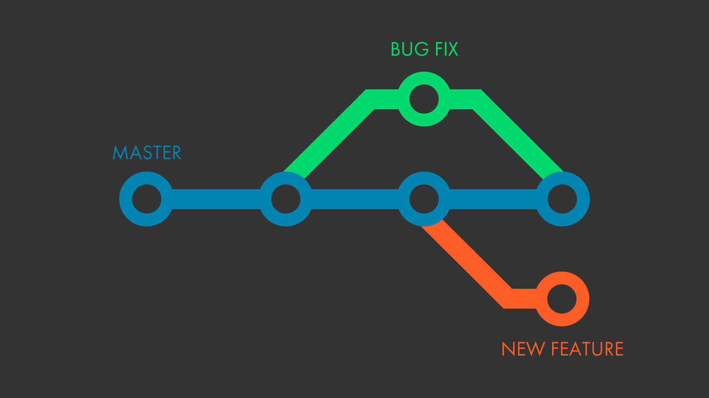

# Git el ADN del Desarrollo de Software

### Antes de la llegada de Git

Seguramente en sus computadores es muy común encontrar esto:

Realizar una copia es como comúnmente se lleva un registro de las nuevas mejoras que se han llevado a cabo en nuestros proyectos. Existían muchos problemas antes de la llegada de git, en mi opinión trabajar en equipo era el más complicado, como logras que varias personas estén trabajando sobre el mismo proyecto y al final del día lleguen a integrar sus cambios, una tarea tediosa ?¿verdad?, ademas de esto no se tenia un control de tiempo de cada versión, saber en que momento se realizo el cambio, que cambios específicamente se realizaron, quien realizo esos cambios etc. Git El tiempo es uno de los recursos mas importantes en el mundo, y siempre buscamos optimizar los procesos para ahorrar este recurso que puede ser aprovechado para otros procesos. El ahorro de tiempo en los equipos de trabajo depende mucho de tener una buena comunicación. Anteriormente a la llegada de git los equipos de trabajo dedicaban mucho tiempo para integrar los cambios en los que trabajaban, se tenían que reunir y explicar las novedades y corregir problemas, esto demandaba mucho tiempo.

El tiempo es uno de los recursos mas importantes en el mundo, y siempre buscamos optimizar los procesos para ahorrar este recurso que puede ser aprovechado para otros procesos. El ahorro de tiempo en los equipos de trabajo depende mucho de tener una buena comunicación. Anteriormente a la llegada de git los equipos de trabajo dedicaban mucho tiempo para integrar los cambios en los que trabajaban, se tenían que reunir y explicar las novedades y corregir problemas, esto demandaba mucho tiempo.

Estos son algunos de los problemas que se presentaban antes de la llegada de git al mundo del desarrollo de software y cambiar nuestras forma de trabajar. Con esto seguramente ya tienen una baga idea de lo que es git y como se ha pasado a ser parte del ADN de un desarrollador de software.


El termino freelance nace en la antigua edad media que significa "lanza libre", era otorgada a aquellos caballeros que no servían a ningún señor, en pocas palabras eran mercenarios que prestaban un servicio según sus habilidades a cambio de una remuneración económica. Actualmente el termino freelance es muy popular, y ya es una profesión certificar. Especialmente este termino es muy usado en el mundo del desarrollo de software, los freelance son contratados para el desarrollo de aplicativos, y lo mas importante de todo, lo hacen de manera remota, pueden estar en sus casas trabajando independientemente. Pues git impulso mucho el crecimiento de esta profesión


### ¿Qué es Git?

Git es un sistema de control de versiones desarrollado por **Linus Torvalds**, el mismo creador del **kernel Linux**, que inicialmente se diseño para entornos linux, pero actualmente es multiplataforma y podemos tenerlo en sistemas Windows y MacOS. Ahora la pregunta es, **¿Que es un sistema de control de versiones?** Es la gestión de los diversos cambios a lo largo del tiempo que se pueden presentar en los elementos de un proyecto o producto que se este desarrollando, estos cambios son adoptados como nuevas versiones que deben ser registradas y accesibles cuando sea necesario. 

Según la documentación oficial, _"... Git comenzó con un poco de destrucción y encendida polémica."_  Como bien sabemos Lunux es un proyecto de software de código abierto bastante grande, entonces empezaron a usar un **Sistema de Control de Versiones Distribuido\(DVCS\)** llamado **BitKeeper** pero que para el 2005 dejo de ser gratuita y la comunidad se vio en la necesidad de crear su propia herramienta de control de versiones, en especial **Torvalds**, pero que fuera diferente a las tecnologías que en el momento ofrecían el servicio para el control de versiones. Las principales características de git son:

* Rápida gestión
* Diseño sencillo de usar
* Desarrollo no lineal\(múltiples ramas en paralelo\)
* Gestión distribuida
* Capaz de manejar grandes proyectos de manera eficiente 


Documentación oficial,  [una breve historia de Git](https://git-scm.com/book/es/v1/Empezando-Una-breve-historia-de-Git).


### Los tres estados

Las archivos y directorios que se van modificando dentro de nuestros proyectos van pasando por unos estados de preparación que se encargan de gestionar las versiones. La simplicidad de git cuenta con tres estados, **modified, committed y  staged**. Cuando se estan realizando cambios en un archivo o conjunto de ellos, en ese momento estos se encuentran en el estado **modified,** una vez se tenga los cambios necesarios listos, se pasa los archivos al estado de **staged,** en este punto los archivos estan listo para ser registrado localmente de manera persistente, y ese ya seria el ultimo estado, el estado **committed,** todos los archivos pasan a ser almacenados de manera segura en las bases de datos locales de git.

Los estados están relacionados con tres estancias dentro de este flujo de git. Inicialmente esta la estancia W**orking directory**, y como su nombre lo dice, es el directorio donde reposa nuestro proyecto, los directorio y bases de datos de git, solo los cambios que se hagan dentro de este directorio serán gestionados por git. **Stagin area**, esta ligada directamente al estado **staged,** es la estancia donde pasan todos nuestros archivos que ya están listos para ser almacenados en las bases de datos de git. Por ultimo tenemos la estancia **Git repository**, estancia donde se encuentran el registro de las modificaciones realizadas, y el almacenamiento en las bases de datos de git para que estos cambio no se pierdan y sean gestionados por git.

### Branches

Uno de los objetivos que busco la comunidad de Linux y **Linus** **Torvalds** con su sistema de control de veriosiones era poder trabajar paralelamente en sus proyectos, y crearon el termino **Branch** o **Rama** en español. Un **Branch** es una bifurcacion que se le hace al proyecto donde se puede trabajar en cambios sin interrumpir el trabajo de otra persona, que pueden estar en otros branches. En Git tenemos un branch principal llamado **Master,**  

### Git una maquina de tiempo

### GitHub y GitLab

### Conflictos

### Git Hooks

### Git en el ADN del desarrollador de software 

### Trabajo en equipo 

### Buenas practicas 

